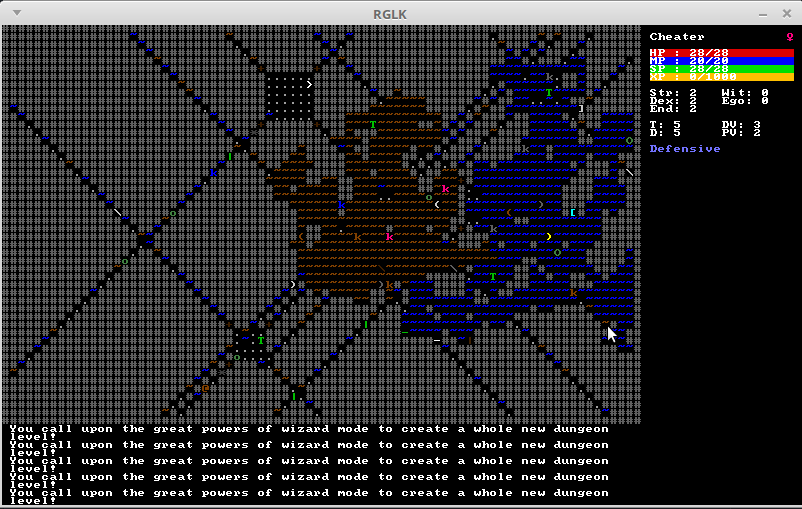

```

 ▄▀▀▄▀▀▀▄ econdite
█   █   █  ▄▀▀▀▀▄ aol
▐  █▀▀█▀  █        of the
 ▄▀    █  █    ▀▄▄  ▄▀▀▀▀▄ achrymose
█     █   █     █ ██    █       ▄▀▀▄ █ nights
▐     ▐   ▐▀▄▄▄▄▀ ▐▐    █      █  █ ▄▀
          ▐            █       ▐  █▀▄  
                     ▄▀▄▄▄▄▄▄▀   █   █
                     █         ▄▀   █  
                     ▐         █    ▐  
                     ▐         ▐       
                               ▐       
                               
```

Simple roguelike in python + libtcod.


### How to play

If you don't know you way with terminal at least a bit, you might want to wait
for me to make executables. The game's in pre-alpha, anyway. :)

Otherwise, open terminal from the RGLK directory and type the following:

```
$ cd src
$ python main.py
```

You might need to install SDL2 unless you have it already.


### Controls

Movement:

```
 KeyPad  or  vi keys  or  arrow keys
  7  8  9     y  k  u
   \ | /       \ | /
  4     6     h     l
   / | \       / | \
  1  2  3     b  j  n

 5  or  .     wait a turn
```

General:

```
 Alt + Enter  toggle full screen
 Esc          main menu
 Space        interact
 Tab          switch tactics

 a            apply item
 c            close
 d            drop item
 E            equipment menu
 Ctrl + e     auto-equip
 g  or  ,     pick up item
 Ctrl + g     pick up all
 i            inventory
 J            jump
 L            look
 M            message history
 o            open
 q            quaff a potion
 Ctrl + q     quit and abandon
 Ctrl + s     save and quit
 T            dig a tunnel or chop wood
 X            exchange places
 <            climb up
 >            climb down
 ?            help
```

Wizard mode:

```
 ;            activate wizard mode

 F1           toggle walking through walls
 F2           toggle seeing through walls
 *F3           alter self
 F4           gain all items
 *F5           summon creature
 F6           possess creature
 *F7           polymorph self
 F8           kill all creatures
 F9           see intrinsics
 F11          level teleport
 F12          generate new level

 *) TODO
```


### Screenshots





